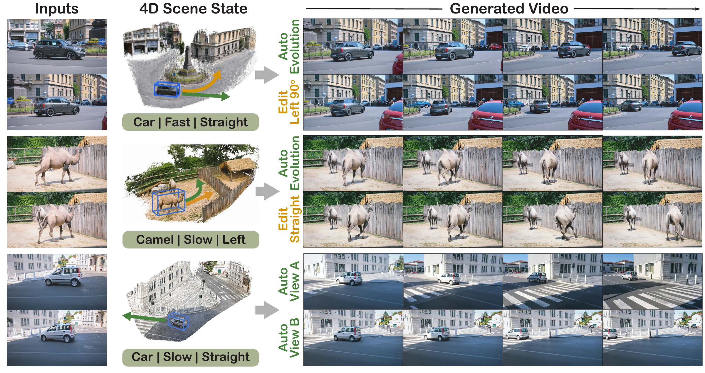
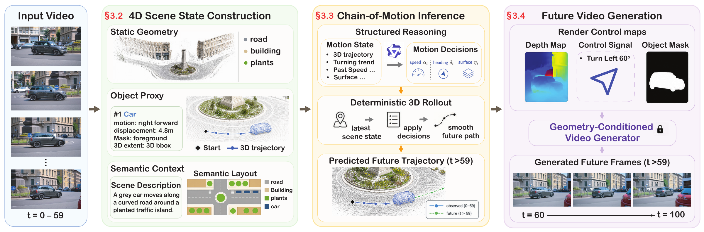
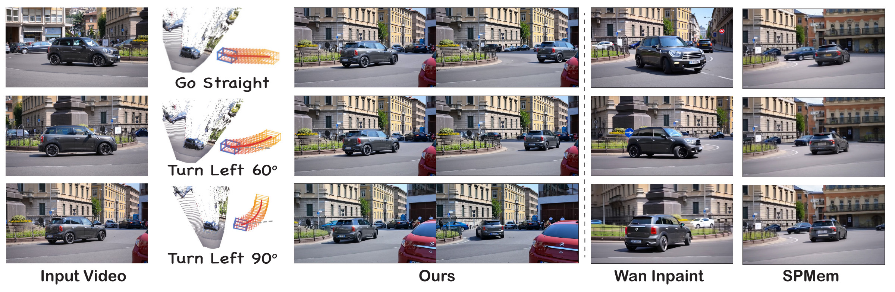

<div align="center">

<h2>Kepler4D: Controllable Future Video Generation<br>via 4D Scene State Evolution</h2>

<p>
  <a href="https://arxiv.org/pdf/2610.04152"></a>
  <a href="https://brack-wang.github.io/kepler4d/"></a>
</p>

<p>
  <a href="https://brack-wang.github.io/">Feiran Wang</a><sup>1</sup>,
  <a href="https://tuffr5.github.io/">Bin Duan</a><sup>2</sup>,
  <a href="https://adreamwu.github.io/">Junyi Wu</a><sup>1</sup>,
  <a href="https://scholar.google.com/citations?user=NIv_aeQAAAAJ&amp;hl=en">Gaowen Liu</a><sup>3</sup>,
  <a href="https://tomyan555.github.io/">Yan Yan</a><sup>1,†</sup>
</p>

<p>
  <sup>1</sup> University of Illinois at Chicago &nbsp;
  <sup>2</sup> University of Michigan Ann Arbor &nbsp;
  <sup>3</sup> Cisco
  <br>
  <sup>†</sup> Corresponding author
</p>

<p><strong>Observe motion. Evolve scene state. Control the future.</strong></p>



</div>

## Introduction

This is the official project repository for **Kepler4D**.

Kepler4D generates future videos through explicit **4D scene state evolution**. Given an observed monocular video, it organizes background geometry, object motion histories, coarse spatial supports, and semantic context in a shared 3D representation. **Chain-of-Motion** reasons over observed motion and scene context to produce structured motion decisions, which a deterministic rollout converts into editable future object trajectories. Rendered geometric controls then guide a pretrained video generator to synthesize future frames.

**Key Features:**

- **Explicit 4D scene state:** Connect scene geometry, observed object motion, and semantic context in a shared world frame.
- **Chain-of-Motion:** Turn structured speed and heading decisions into inspectable future 3D trajectories through deterministic rollout.
- **Language-guided trajectory editing:** Specify alternative object motion before video synthesis.
- **Viewpoint-aware generation:** Render the scene state and object trajectories under target camera paths to guide future video generation.

## Method Overview

<p align="center">
  
</p>

1. **Construct the scene state.** Recover background geometry and object proxies with observed 3D trajectories, spatial supports, and semantic context.
2. **Evolve object motion.** Infer structured motion decisions and expand them into future 3D trajectories that can be inspected or edited.
3. **Generate future video.** Render depth maps, object control signals, and masks to guide a pretrained video generator. The trajectories specify coarse object motion, while the generator synthesizes appearance and local articulation.

## Language-Guided Future Generation

High-level instructions such as **"Go Straight," "Turn Left 60°,"** and **"Turn Left 90°"** produce different object trajectories from the same observed video.

<p align="center">
  
</p>

The second column shows the inferred trajectories. The comparison methods receive the same language commands; Kepler4D additionally uses its inferred trajectories and rendered geometric controls.

## Citation

If you find this work useful, please consider citing it:

```bibtex
@misc{wang2026kepler4d,
  title={{Kepler4D}: Controllable Future Video Generation via 4D Scene State Evolution},
  author={Wang, Feiran and Duan, Bin and Wu, Junyi and Liu, Gaowen and Yan, Yan},
  year={2026},
  url={https://github.com/Brack-Wang/kepler4d}
}
```
